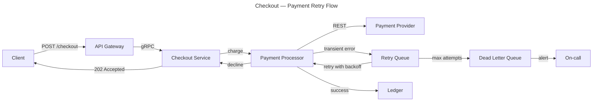

# Checkout — payment retry flow

## Context

How a checkout charge is attempted, retried on transient failures, and what happens when attempts are exhausted. Refund handling is out of scope.

## Diagram

## Notes

- Retry budget and backoff schedule are config-driven; dead letters page on-call.
