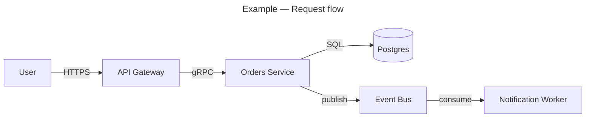

# Example — request flow

## Context

Sample diagram shipped with the base repo so `scripts/render.sh` and CI have something to verify. Delete it once real diagrams exist.

## Diagram

```mermaid
---
title: Example — Request flow
---
flowchart LR
    user["User"] -->|HTTPS| gateway["API Gateway"]
    gateway -->|gRPC| orders["Orders Service"]
    orders -->|SQL| db[("Postgres")]
    orders -->|publish| bus["Event Bus"]
    bus -->|consume| notify["Notification Worker"]
```
