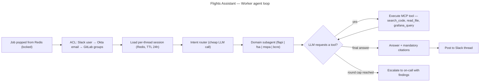

# Flights Assistant — Worker agent loop

## Context

What a worker does after popping a job: identity/permission resolution, routing into a repo-scoped subagent, and the stateless LLM tool loop that ends in a cited answer or an escalation. Timeline view lives in `flights-assistant-event-flow.md`; component view in `flights-assistant-bot.d2`.

## Diagram

## Notes

- Every LLM round is one stateless HTTPS call carrying the full context — "the agent" is this loop plus the tool schemas, nothing more.
- Subagents start with fresh, repo-scoped context, so one team's data never bleeds into another's answer.
- Escalation is a first-class outcome: an honest "I don't know, here's who does" beats a confident wrong answer.
