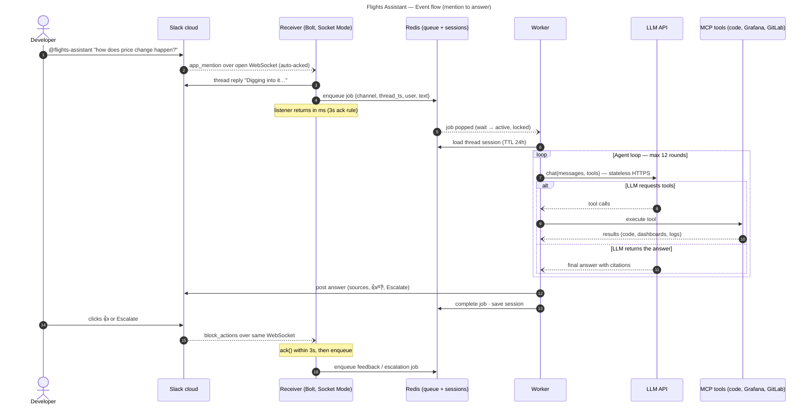

# Flights Assistant — Event flow (mention to answer)

## Context

End-to-end flow for a single question: what happens after a developer tags `@flights-assistant` until the answer lands in the thread, including the 3-second ack rule and the queue handoff. Out of scope: MCP tool internals and deployment topology — see `flights-assistant-bot.d2` and `flights-assistant-network.d2`.

## Diagram

## Notes

- The receiver never calls the LLM; the worker never touches Slack's socket — Redis is the only shared boundary between them.
- If a worker dies mid-job, its lock expires and BullMQ returns the job to the queue for another worker.
- Slack retries un-acked events; using `jobId = event_id` makes those retries harmless.
