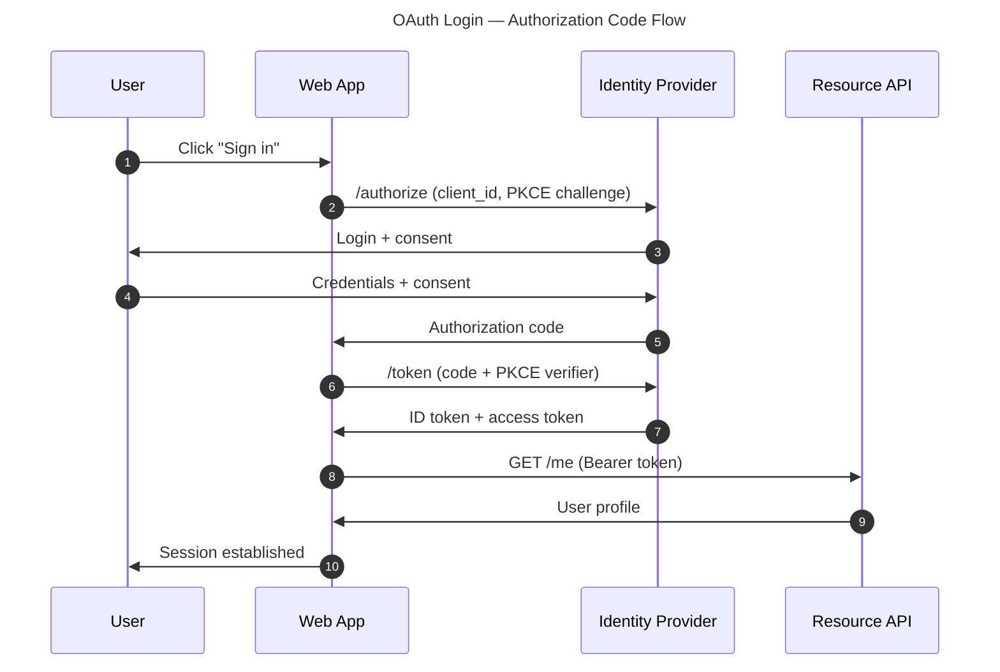

# OAuth login — sequence

## Context

Authorization-code flow with PKCE used when a user signs in through the company identity provider. Token refresh and logout are out of scope.

## Diagram

```mermaid
---
title: OAuth Login — Authorization Code Flow
---
sequenceDiagram
    autonumber
    participant U as User
    participant A as Web App
    participant I as Identity Provider
    participant R as Resource API

    U->>A: Click "Sign in"
    A->>I: /authorize (client_id, PKCE challenge)
    I->>U: Login + consent
    U->>I: Credentials + consent
    I->>A: Authorization code
    A->>I: /token (code + PKCE verifier)
    I->>A: ID token + access token
    A->>R: GET /me (Bearer token)
    R->>A: User profile
    A->>U: Session established
```
