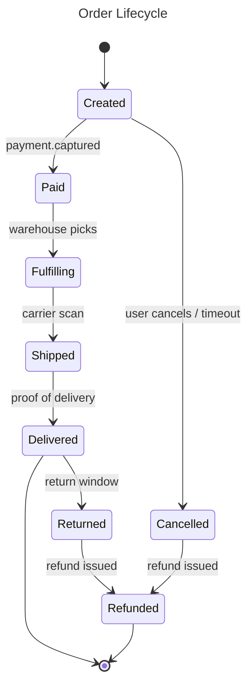

# Order lifecycle — state machine

## Context

States an order moves through from creation to terminal state, and the events that trigger transitions. Inventory reservation is not modeled here.

## Diagram

