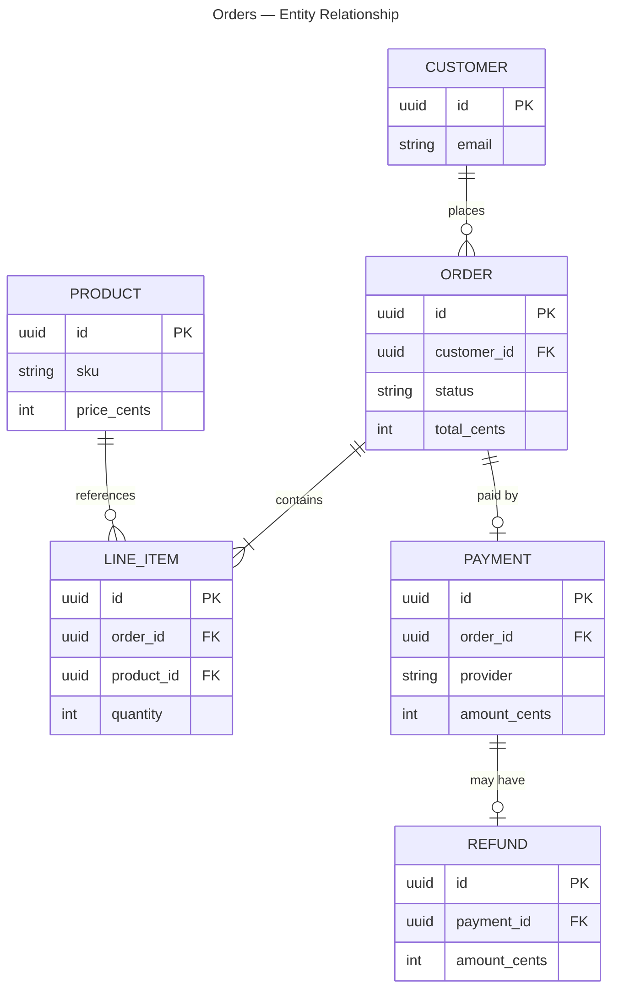

# Orders — data model

## Context

Core relational model behind checkout and payments. Inventory and shipping tables are out of scope.

## Diagram

```mermaid
---
title: Orders — Entity Relationship
---
erDiagram
    CUSTOMER ||--o{ ORDER : places
    ORDER ||--|{ LINE_ITEM : contains
    ORDER ||--o| PAYMENT : "paid by"
    PRODUCT ||--o{ LINE_ITEM : references
    PAYMENT ||--o| REFUND : "may have"

    CUSTOMER {
        uuid id PK
        string email
    }
    ORDER {
        uuid id PK
        uuid customer_id FK
        string status
        int total_cents
    }
    LINE_ITEM {
        uuid id PK
        uuid order_id FK
        uuid product_id FK
        int quantity
    }
    PAYMENT {
        uuid id PK
        uuid order_id FK
        string provider
        int amount_cents
    }
    REFUND {
        uuid id PK
        uuid payment_id FK
        int amount_cents
    }
    PRODUCT {
        uuid id PK
        string sku
        int price_cents
    }
```
