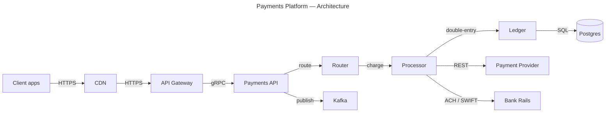

# Payments Platform — Architecture

## Context

Service map for the payments platform: how client traffic reaches the payments service, and how charges flow to the ledger and external payment rails. Fraud scoring and reconciliation jobs are out of scope.

## Diagram

## Notes

- Ledger is the source of truth; the processor never mutates balances directly.
