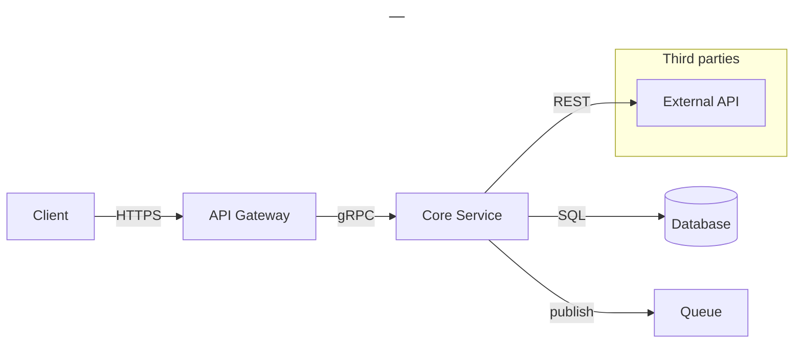

# <System name> — <diagram type>

## Context

<2–3 lines: what this diagram explains, who it is for, and what is deliberately out of scope.>

## Diagram

## Notes

- <key decision, caveat, or link to a related diagram>
